<div align="center">
  
</div>

# 🐦 Aumne Microblog: Next-Gen Social Platform

Microblog is a high-performance, Twitter-like social media platform built to demonstrate **Senior-level engineering practices**. While fulfilling all baseline requirements (FastAPI, ReactJS, SQLite, OpenAPI SDK), this project implements production-ready architecture designed to scale.


---

## 🏗️ Architecture & Engineering Highlights

This is not a standard CRUD application. This platform has been fortified with advanced architectural patterns typically found in large-scale distributed systems:

- **⚡ True Real-Time Push (SSE)**: Replaced naive 5-second HTTP polling with native **Server-Sent Events**. The `asyncio` backend holds connections open natively and pushes lightweight events to the React UI the millisecond a post or like occurs.
- **🛡️ API Rate Limiting (`slowapi`)**: Protects the platform from abuse. 
  - `POST /posts/` -> Max 10 per minute per IP
  - `POST /posts/{id}/like` -> Max 30 per minute per IP
  - `GET /posts/` -> Max 60 per minute per IP
- **📦 HTTP ETag Caching**: The backend computes a global state hash. When clients request data they already have, the server yields a `304 Not Modified`, saving 100% of the JSON payload bandwidth.
- **🚀 In-Memory TTL Query Caching**: Database-heavy aggregations (like Trending Tags) are globally cached using `cachetools` for 5-second intervals, entirely eliminating DB overload during high-traffic spikes.
- **💨 Asynchronous Broadcasting**: Global state aggregation and SSE client notifications are completely decoupled from request latency using FastAPI `BackgroundTasks`.

---

## 🛠️ Technology Stack

| Layer | Technology |
|---|---|
| **Backend API** | FastAPI 0.111, Python 3.10+ |
| **Database** | SQLite + SQLAlchemy ORM + Alembic Migrations |
| **Frontend** | ReactJS 18, Axios, Custom Hooks (Debouncing) |
| **SDK** | Auto-generated standard standard Python client via OpenAPI Generator CLI |
| **Tests** | `pytest` + `httpx` (23 passing test cases, 100% coverage block) |

---

## 🚀 Quick Start (Windows)

All setup is fully automated.

```bat
REM 1. Create venv, install Python/Node dependencies, and migrate database
> setupdev.bat

REM 2. Start the FastAPI backend and React frontend
> runapplication.bat
```

- **Frontend Application**: [http://localhost:3000](http://localhost:3000)
- **Backend API & Swagger Docs**: [http://localhost:8000/docs](http://localhost:8000/docs)

---

## 🧠 Trick Logic & Enforced Rules

1. **280-character limit**: Enforced securely via Pydantic model validation on the API edge.
2. **One Like Per User**: Enforced via a composite `UNIQUE(post_id, user_name)` constraint in the SQLite database, preventing duplicate likes even in multi-threaded race conditions.
3. **No-DB User Identification**: Seamlessly implemented by allowing the user to set a global "handle" in the UI, stored safely in `localStorage` and attached anonymously to payload bodies as explicitly requested by the guidelines.

---

## 🧪 Testing

The backend includes a comprehensive test suite covering standard flows, boundary logic (281 chars), rate limit bypasses, and constraint integrity check.

```bash
cd backend
python -m pytest tests/ -v
```
*Expected Output: 23 passed.*

---

## 📦 Python SDK Generation & Demo

The CLI SDK is entirely auto-generated from the live OpenAPI specification.

### 1. Generate the SDK
```bash
npm install -g @openapitools/openapi-generator-cli
openapi-generator-cli generate -i http://localhost:8000/openapi.json -g python -o microblog_sdk --package-name microblog_sdk
```

### 2. Run the Demonstration Suite
We've included a robust smoke-test that demonstrates using the generated Python API Client to create posts, manipulate likes, trigger 409 errors correctly, extract hashtags, and execute full-text search.

```bash
# Ensure backend is running first!
python sdk_demo.py
```

---

## 🗺️ System Diagram

```mermaid
sequenceDiagram
    participant UI as React Frontend
    participant API as FastAPI
    participant Q as Background Tasks
    participant DB as SQLite
    
    UI->>API: POST /posts (New Post)
    API->>DB: INSERT post
    DB-->>API: 200 OK
    API--)Q: Fire notify_clients() asynchronously
    API-->>UI: 201 Created
    
    rect rgb(0, 40, 20)
    note right of Q: SSE Broadcast
    Q->>API: Push 'refresh' signal to queues
    API-->>UI: SSE Event: data: update
    end
    
    UI->>API: GET /posts/ (Fetch updated feed)
    note right of API: If ETag matches: 304 Not Modified<br/>Else: Query Database
    API->>DB: SELECT posts
    DB-->>API: rows
    API-->>UI: 200 OK + Payload
```


